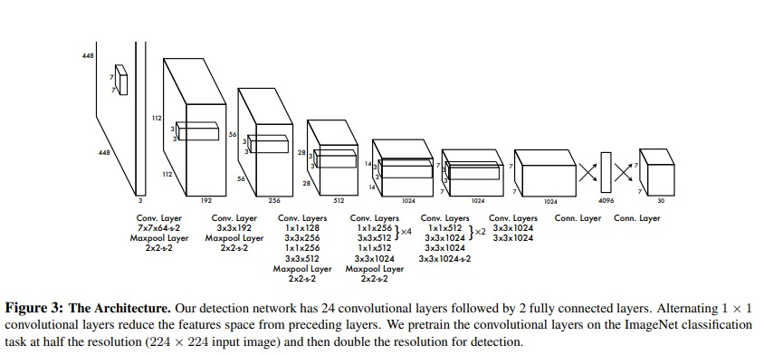
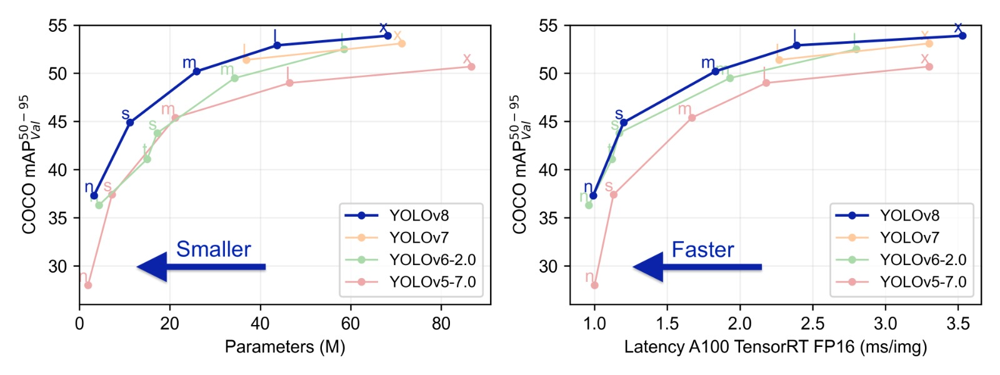
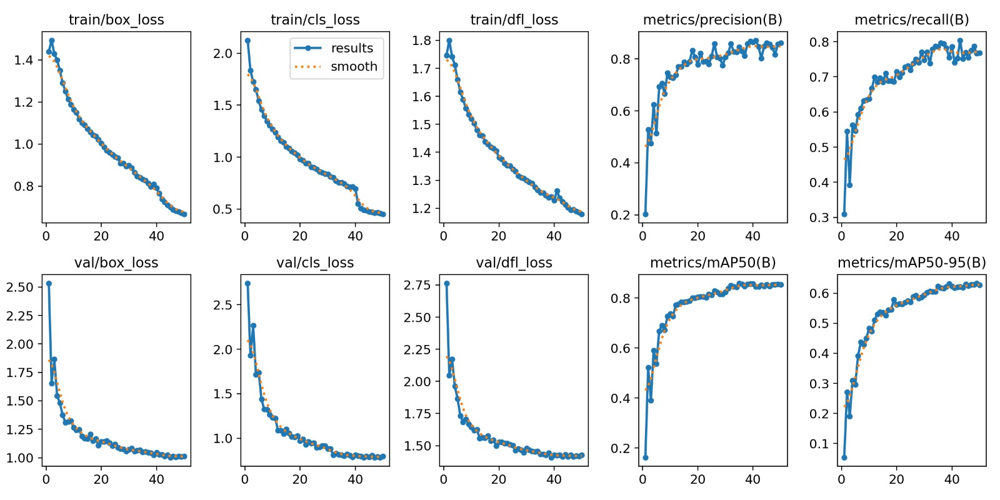
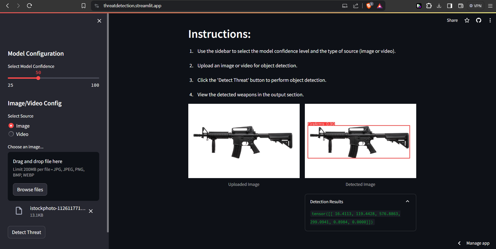
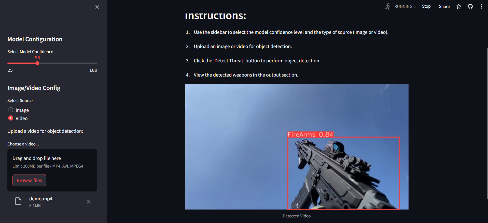

# Threat Detection Using YOLOv8


## Table of Contents

- [Introduction](#introduction)
- [YOLO Architecture](#yolo-architecture)
- [Usage](#usage)
- [Parameters Intuition](#parameters-intuition)
- [Result Metrics](#result-metrics)
- [Streamlit App](#streamlit-app)

## Introduction

This project focuses on detecting threats such as guns and sharp weapons (e.g., knives) in real-time using the YOLOv8 object detection model. By analyzing video feeds or images, the system can promptly identify and alert authorities or security personnel to potential security risks. This technology can be applied in public spaces, airports, and other security-sensitive environments to enhance safety and security measures.


## YOLO Architecture

YOLO (You Only Look Once) is a state-of-the-art, real-time object detection system. The main concept behind YOLO is to frame object detection as a single regression problem, straight from image pixels to bounding box coordinates and class probabilities.

### Key Features of YOLO

- **Unified Detection**: YOLO divides the image into an SxS grid and predicts bounding boxes and probabilities for each grid cell.
- **Single Pass Detection**: Instead of sliding windows or region proposals, YOLO makes predictions with a single network evaluation.
- **End-to-End Training**: The detection pipeline is trained end-to-end directly on detection performance.

### YOLOv8 Enhancements

- **Improved Backbone**: Enhanced network architecture for better feature extraction.
- **Anchor-Free Design**: Reduces the complexity of anchor-based predictions.
- **Optimized for Speed and Accuracy**: Balances the trade-off between inference speed and detection accuracy.

The architecture works as follows:

1. **Resizing**: The input image is resized to 448x448 before going through the convolutional network.
2. **Convolutions**: A 1x1 convolution is first applied to reduce the number of channels, which is then followed by a 3x3 convolution to generate a cuboidal output.
3. **Activation Functions**: The activation function under the hood is ReLU, except for the final layer, which uses a linear activation function.
4. **Regularization**: Additional techniques, such as batch normalization and dropout, are used to regularize the model and prevent it from overfitting.

#### generalised YOLO first genenaration architecture

#### YOLOv8 in comparison with previous models with faster convergence


## Usage

To set up and run the threat detection model on images or videos, follow these steps:

1. **Clone the Repository**:
    ```bash
    git clone https://github.com/sayan-does/threat-detection.git
    cd threat-detection
    ```

2. **Create a Virtual Environment**:
    ```bash
    python -m venv venv
    source venv/bin/activate  # On Windows use `venv\Scripts\activate`
    ```

3. **Install Dependencies**:
    ```bash
    pip install -r requirements.txt
    ```

4. **Download Pre-trained Weights**:
    Download the pre-trained YOLOv8 weights and place them in the `weights` directory.

5. **Run the Streamlit App**:
    ```bash
    streamlit run main.py
    ```

## Parameters Intuition

### Key Parameters

- **epochs**: (default=100) This parameter defines the number of complete passes through the training dataset. Increasing epochs can improve model accuracy but also increases training time.
- **imgsz**: (default=640) Image size for training and inference. Larger sizes can improve accuracy but require more memory and computation.
- **plots**: (default=True) Enables plotting of training results. Helpful for visualizing training progress.
- **patience**: (default=10) Number of epochs to wait for improvement before stopping training early. Helps prevent overfitting.
- **seed**: (default=42) Random seed for reproducibility of results.
- **lr0**: (default=0.001) Initial learning rate. Controls how much to change the model in response to the estimated error each time the model weights are updated.
- **dropout**: (default=0.5) Fraction of the input units to drop during training. Helps prevent overfitting.
- **val**: (default=True) Enables validation during training to monitor model performance on unseen data.
- **label_smoothing**: (default=0.2) Technique to prevent the model from becoming too confident about its predictions, leading to better generalization.
- **verbose**: (default=True) Controls the verbosity of the training process. Set to `True` for detailed logs.
- **cos_lr**: (default=True) Enables cosine learning rate scheduling for smoother training.
- **single_cls**: (default=False) Treats the dataset as a single-class problem.
- **batch**: (default=32) Batch size for training. Larger batches make the training more stable but require more memory.
- **freeze**: (default=7) Number of layers to freeze during training. Freezing early layers can help speed up training and reduce overfitting.

### Tuning Tips

- **Lower Confidence**: Use a lower confidence threshold if you want to capture more objects, at the risk of increasing false positives.
- **Higher Confidence**: Use a higher confidence threshold to reduce false positives, at the risk of missing some true positives.

## Result Metrics

### Detection Metrics

- **Precision**: 0.873
- **Recall**: 0.75
- **F1 Score**: 0.805
- **Inference Time**: 4.9 ms/frame




## Streamlit App

The Streamlit app provides an interactive interface for uploading images or videos and performing threat detection.

### Main Features

- **Model Configuration**: Adjust the confidence threshold for detection.
- **Image/Video Upload**: Upload images or videos for detection.
- **Real-Time Detection**: View detected threats in real-time with bounding boxes.

### Running the App

To run the Streamlit app, use the following command:

```bash
streamlit run main.py
```


